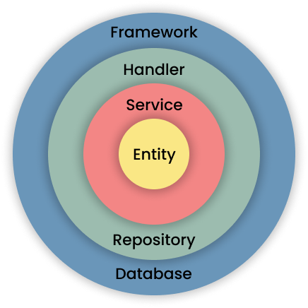
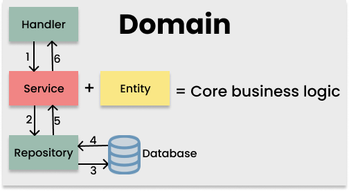

# Structure

```
clean-architecture-go
├── config
│   └── config.go
├── docs
│   ├── app.env.example
│   └── swagger.yaml
├── internal
│   └── student
│       ├── handler
│       │   ├── handler.go
│       │   └── payload.go
│       ├── repository
│       │   ├── model.go
│       │   ├── repository.go
│       │   └── repository_mock.go
│       ├── service
│       │   ├── service.go
│       │   └── service_test.go
│       └── entity.go
├── pkg
│   ├── database
│   │   └── mysql.go
│   ├── third_party_api
│   │   └── third_party_api.go
│   └── util
│       └── copy.go
├── Makefile
├── README.md
├── app.env
├── go.mod
├── go.sum
└── main.go
```

Pada struktur direktori di atas terdapat direktori internal dan di dalamnya ada domain student, lalu di dalam domain ada core object representasi dari domain student dan beberapa layer seperti handler, reposiotry, dan service.

# Entity

Di dalam Entity ada stuct Core representasi dari object domain. Core juga digunakan sebagai muatan data yang digunakan untuk berkomunikasi antar layer. Lalu ada contact yang terdiri dari interface-interface. Saya biasa mengartikan entity ini sebagai business rules.

```
type Core struct {
	ID   int
	NPM  int // Nomor Induk Mahasiswa
	Name string
}

type Handler interface {
	Create(ctx echo.Context) error
    // Do something...
}

type Service interface {
	Create(studentCore Core) error
    // Do something...
}

type Repository interface {
	Create(studentCore Core) error
    // Do something...
}

```

# Service

Layer service adalah layer yang berisikan business logic dari aplikasi. Pada directory ini terdapat beberapa file yaitu file service.go dan service_test.go. File service.go berisikan kode logic aplikasi dan file service_test.go berisikan testing logic aplikasi.

`/student/service/service.go`

```
type studentService struct {
	repo student.Repository
}
func New(r student.Repository) student.Service {
	return &studentService{repo: r}
}
func (ss *studentService) Create(studentCore student.Core) (student.Core, error) {
    // Do something...
}
```

Pada pembuatan struct “studentService” dibutuhkan object yang mengimplementasikan interface “student.Repository”. Benefit dari abstraksi ini memudahkan saat melakukan unit testing pada layer service, dan bebas dependency call database.

`/student/service/service_test.go`

```
func TestGetStudentByID(t *testing.T) {
	sampleData := student.Core{
        // Data..
	}

	t.Run("should return list catalogues data", func(t *testing.T) {
		repoMock := new(repository.StudentRepositoryMock)
        srv := New(repoMock)

        repoMock.On("Create", sampleData).Return(sampleData, nil).Once()


        // Do something...
	})
}
```

Pada baris “repoMock := new(repository.StudentRepositoryMock)” dilakukan instantiation object yang nantinya di inject pada saat pembuatan object “studentSerice”.
Bisa dilihat pada baris “srv := New(repoMock)”

# Repository

Layer repository adalah layer yang berkomunikasi dengan database dan proses dimana data dari object domain(core) disimpan. Pada directory ini terdapat file model.go, repository.go dan repository\*mock.go.
File model.go berisikan kode model object representasi dari model atau table pada mysql, File repository.go berisikan query ke database, dan file repository_mock.go berikan kode untuk mock repository.

`/student/repository/model.go`

```
type Student struct {
    gorm.Model
    NPM int `gorm:"column:npm"`
    Name string `gorm:"column:name"`
}
```

`/student/repository/repository.go`

```
type studentRepository struct {
	db *gorm.DB
}

func New(db *gorm.DB) student.Service {
	return &studentRepository{db: db}
}

func (ss *studentRepository) Create(studentCore student.Core) error {
	model := Student{
		NPM:  studentCore.NPM,
		Name: studentCore.Name,
	}
	tx := ss.db.Create(&model)
	if tx.Error != nil {
		return fmt.Errorf("create student in student repository error: %w", tx.Error)
	}
	return nil
}


```

Setelah mendapatkan data dari database, selanjutnya diconvert ke domain object(core) untuk diproses ke layer service lagi.

`/student/repository/repository_mock.go`

```
type StudentRepositoryMock struct {
    mock.Mock
}
func (srm *StudentRepositoryMock) Create(studentCore student.Core) error {
	args := srm.Mock.Called(studentCore)
	ret1, _ := args[1].(error)
	return ret1
}
```

Pada file ini, Saya membuat mock repository, supaya pada saat melakukan unit test tidak melakukan query ke database. karena fungsi dari unit test ini hanya melakukan uji coba pada logic aplikasi. Struct “StudentRepositoryMock” mengimplementasikan interface “student.Repository” yang nantinya bisa diinject ke service pada dan membuat unit test.

# Handler

Layer handler adalah layer yang bertindak sebagai presenter. Memutuskan bagaimana data akan digunakan. Bisa seperti REST API, file HTML, atau GRPC apapun jenis deliverynya. Layer ini juga langsung berkomunikasi ke pengguna seperti menerima input dan mengirimkan output.
Pada directory handler terdapat beberapa file yaitu handler.go layernya itu sendiri dan payload.go yang berisikan object untuk memuat response dan request.

`/student/handler/handler.go`

```
type studentHandler struct {
	srv student.Service
}

func New(s student.Service) student.Handler {
	return &studentHandler{srv: s}
}

func (sh *studentHandler) Create(ctx echo.Context) error {
    // Do something...

	if err := sh.srv.Create(studentCore); err != nil {
		return ctx.JSON(util.ErrorResponse(err))
	}
	return ctx.JSON(util.SuccessResponse(201, "success"))
}
```

`/student/handler/payload.go`

```
type studentReponse struct {
	ID   int    `json:"id"`
	NPM  int    `json:"npm"`
	Name string `json:"name"`
}

type studentRequest struct {
	NPM  int    `json:"npm,omitempty"`
	Name string `json:"name,omitempty"`
}
```
